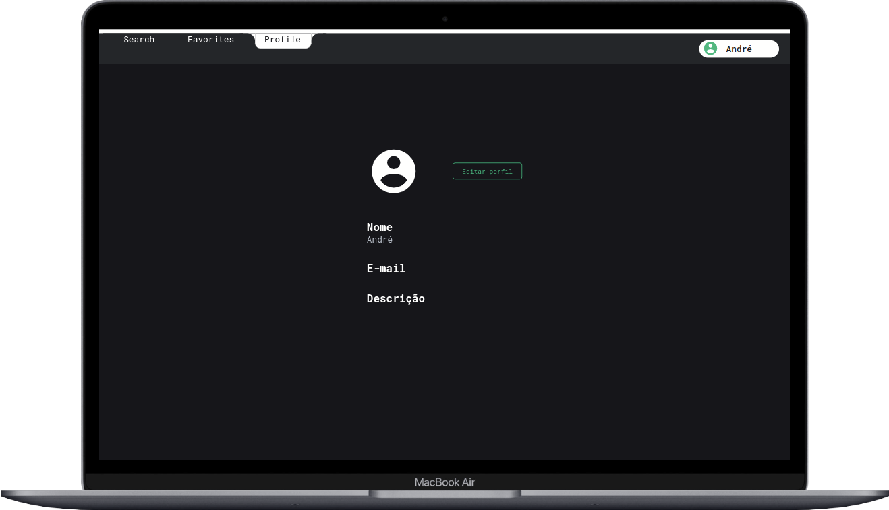

# Projeto Trybetunes


# Contexto

Este projeto é um aplicativo de músicas, feito no módulo de Front-end no curso da Trybe, em que podemos pesquisar pelos albuns de um artista, ouvir suas músicas, e favoritá-las.


Ele foi feito usando react com componentes de classe, e usa a api do itunes para pegar as musicas, o meu maior desafio (e orgulho) foi fazer o player de audio customizado.


Eu fiz a estilização usando o Spotify como inpiração, e fiz um prototipo no Figma.




## Técnologias usadas

Front-end:

> Desenvolvido usando: React, CSS3, HTML5, javaScript

## Instalando Dependências

> Frontend

```bash
git clone git@github.com:Andre-ARS/trybetunes.git
cd trybetunes
npm install
```

## Executando aplicação

* Para rodar o front-end:

  ```
  npm start
  ```

## Link da Aplicação

    [trybetunes](https://andre-trybetunes.vercel.app/)
